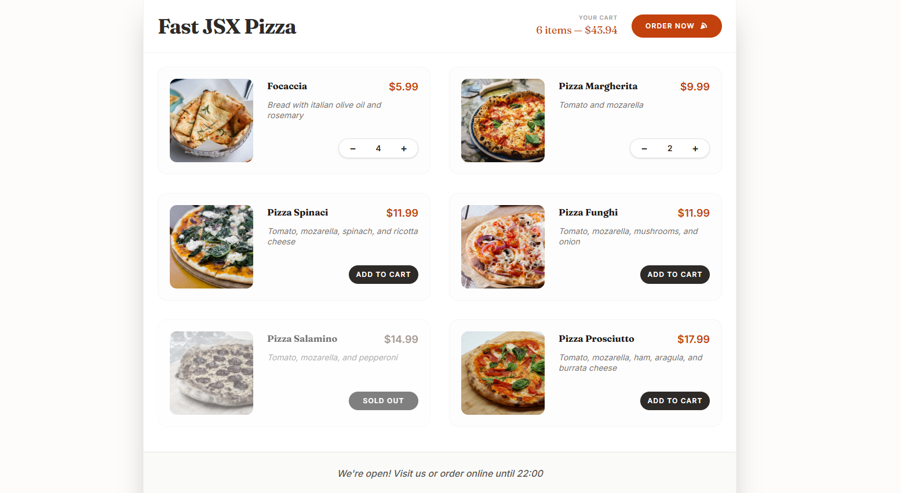

<h1>Pizza Menu</h1>

https://pizza-menux.netlify.app/

  A project from a React JS training: Online pizza menu and ordering application.

## 👍 My Challenges:

- Tailwind CSS has been applied.
- Separated components were created.
- "Add to Favorites" button added.
- Pop-up modal window implemented.
- And efforts were made to provide a good user experience.

## 🎉 Build With:

- React JS + Tailwind CSS
- Semantic HTML markup
- CSS Flexbox
- Mobile-first workflow
- Custom CSS properties
