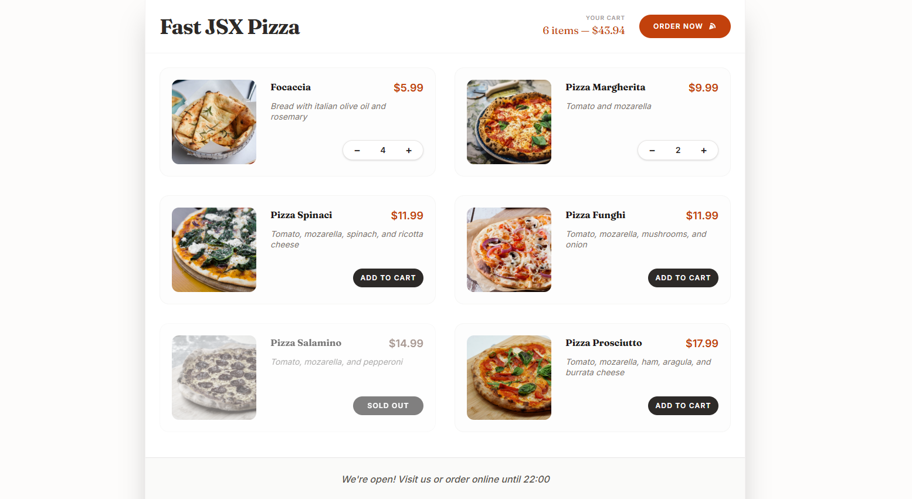

<h1>Fast Jsx Pizza</h1>

https://fast-jsx-pizza.netlify.app/

A React project demonstrating jsx `components` and `props` by building a dynamic pizza ordering interface.

## 👍 My Challenges:

- **update** 'Add to Cart' and 'Shopping Cart' buttons have been added.
- Tailwind CSS has been applied.
- Separated components were created.
- Pop-up modal window implemented.
- And efforts were made to provide a good user experience 🙂

## 🎉 Build With:

- React JS + Tailwind CSS
- Semantic HTML markup
- CSS Flexbox and Grid
- Mobile-first workflow
- Custom CSS properties
